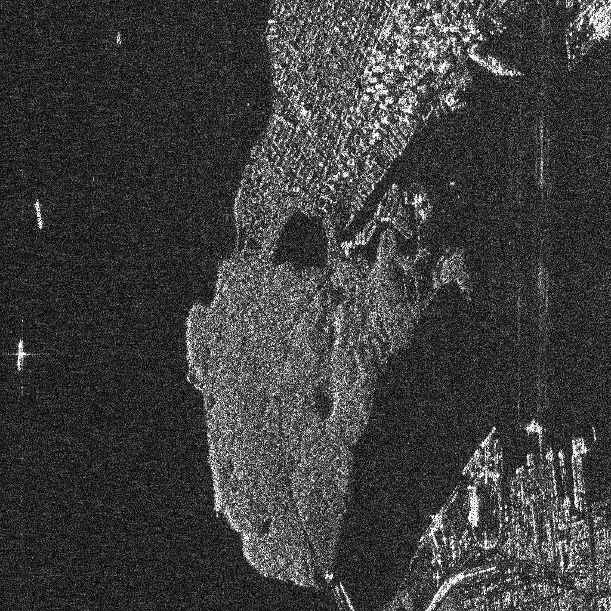
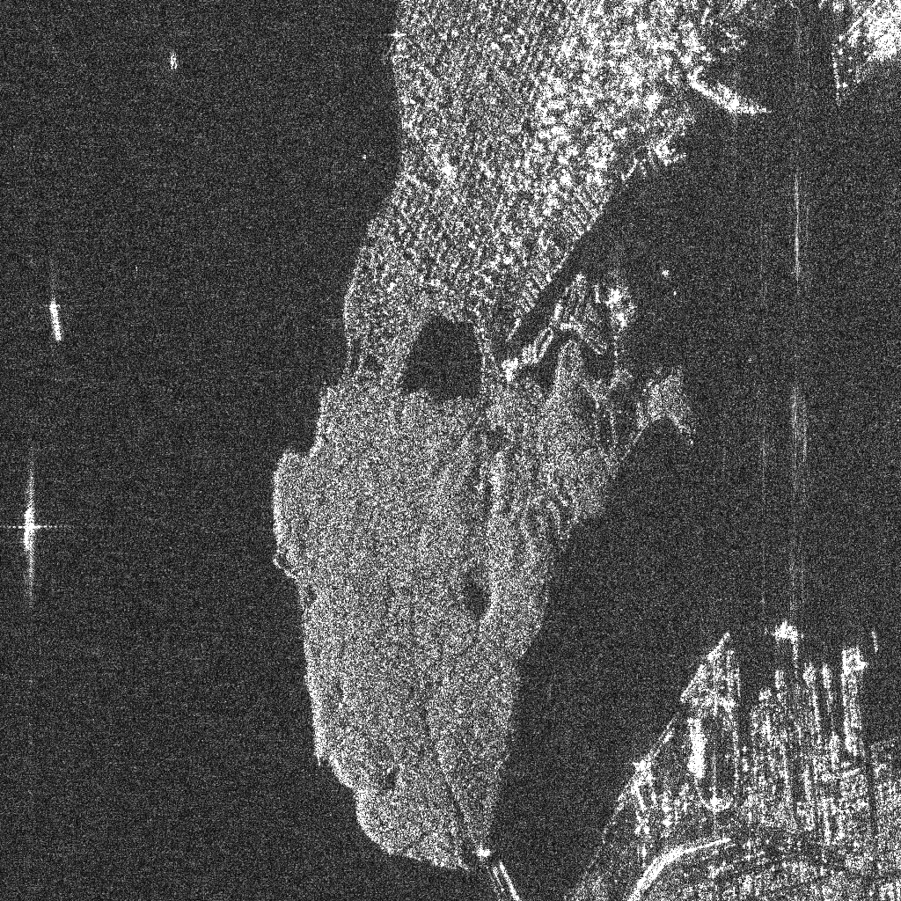
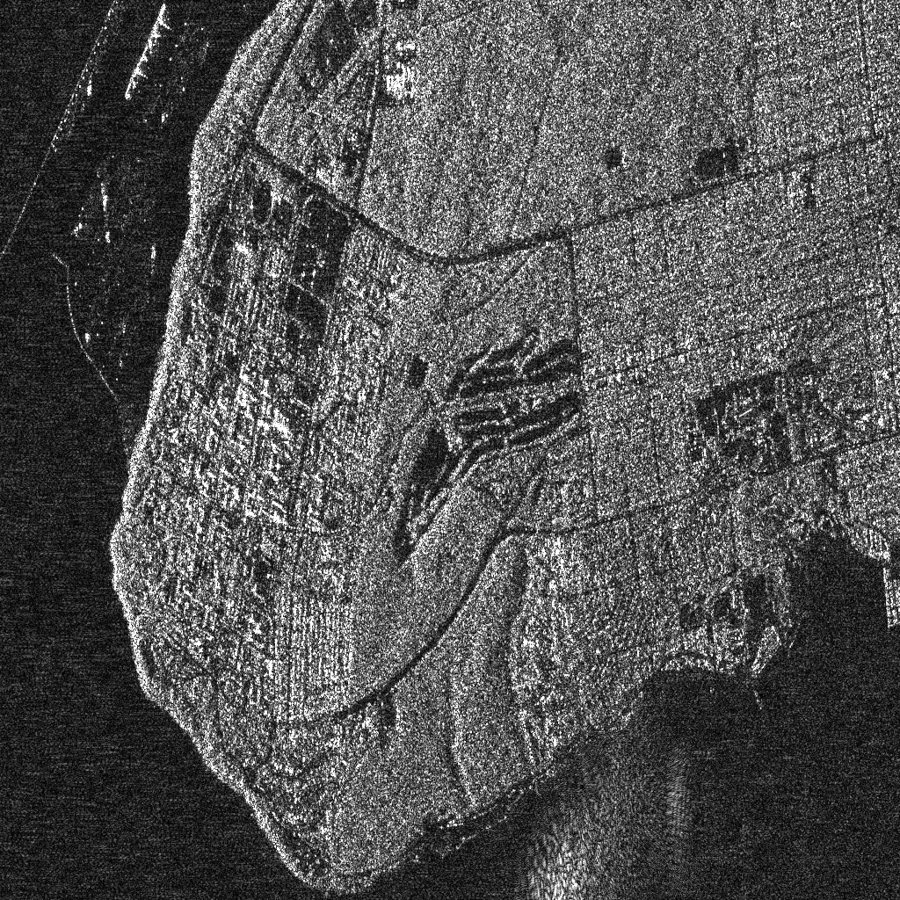
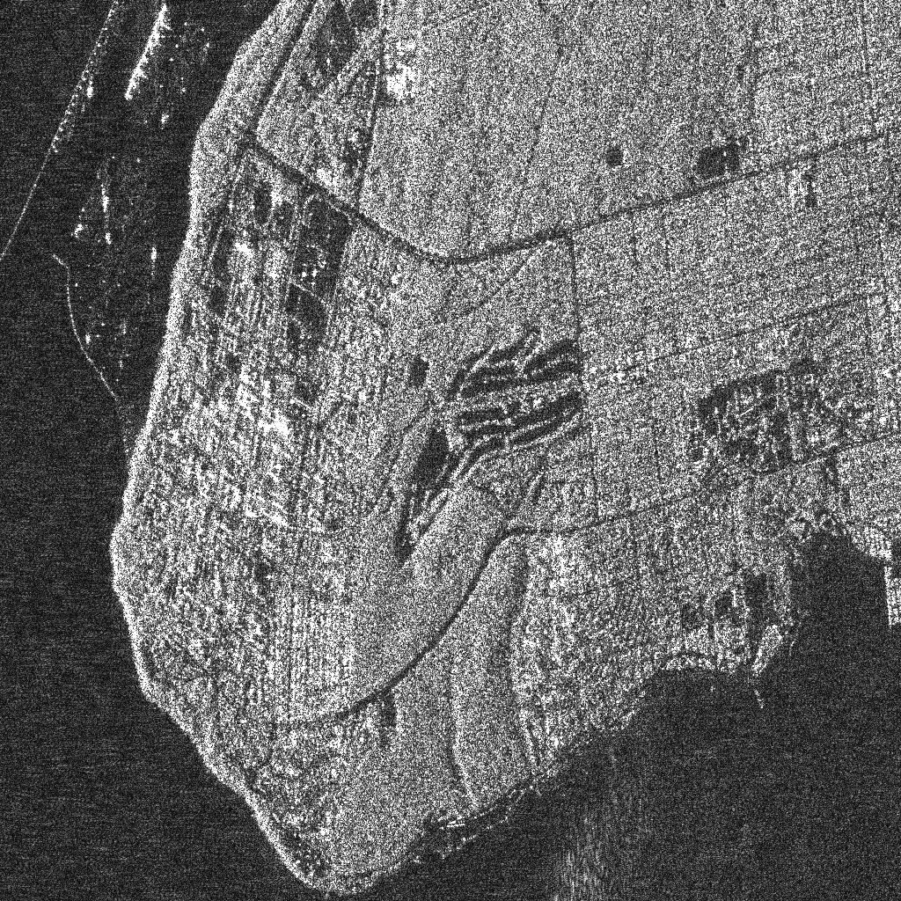
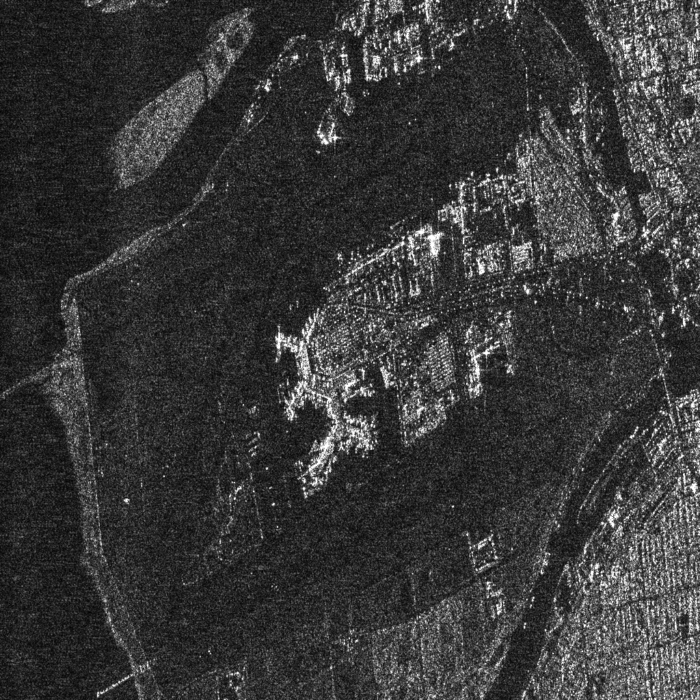
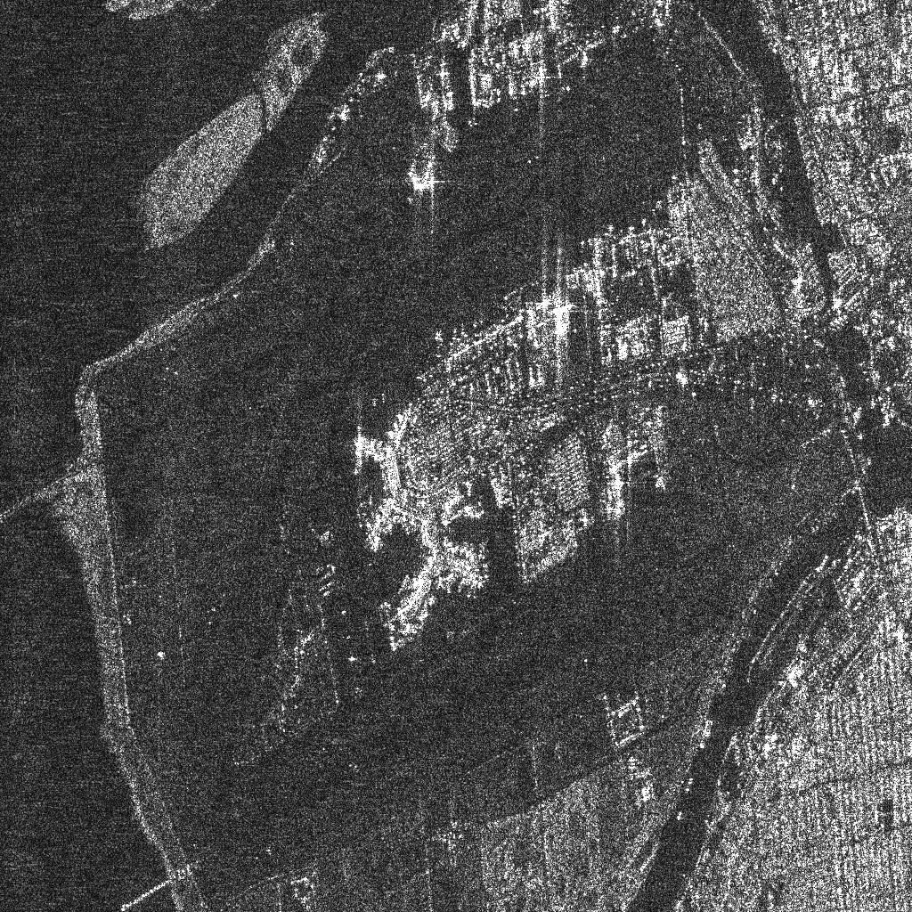

## Welcome to AISAR

Artificial intelligence for Synthetic Aperture Radar.

### Projects

- [torchsar](https://sar.iridescent.ink/torchsar): Synthetic Aperture Radar in PyTorch.
- [iprs3.0](https://iridescent.ink/iprs3.0/): Synthetic Aperture Radar in Python.

<figure>

</figure>
ALOS, Stanley Park,  Envi (Left), Torchsar (Right)

<figure>

</figure>
ALOS, University of British Columbia,  Envi (Left), Torchsar (Right)

<figure>

</figure>
ALOS, Vancouver Airport,  Envi (Left), Torchsar (Right)

__© Copyright 2017-2021, Zhi Liu, School of Artificial Intelligence, Xidian University__
