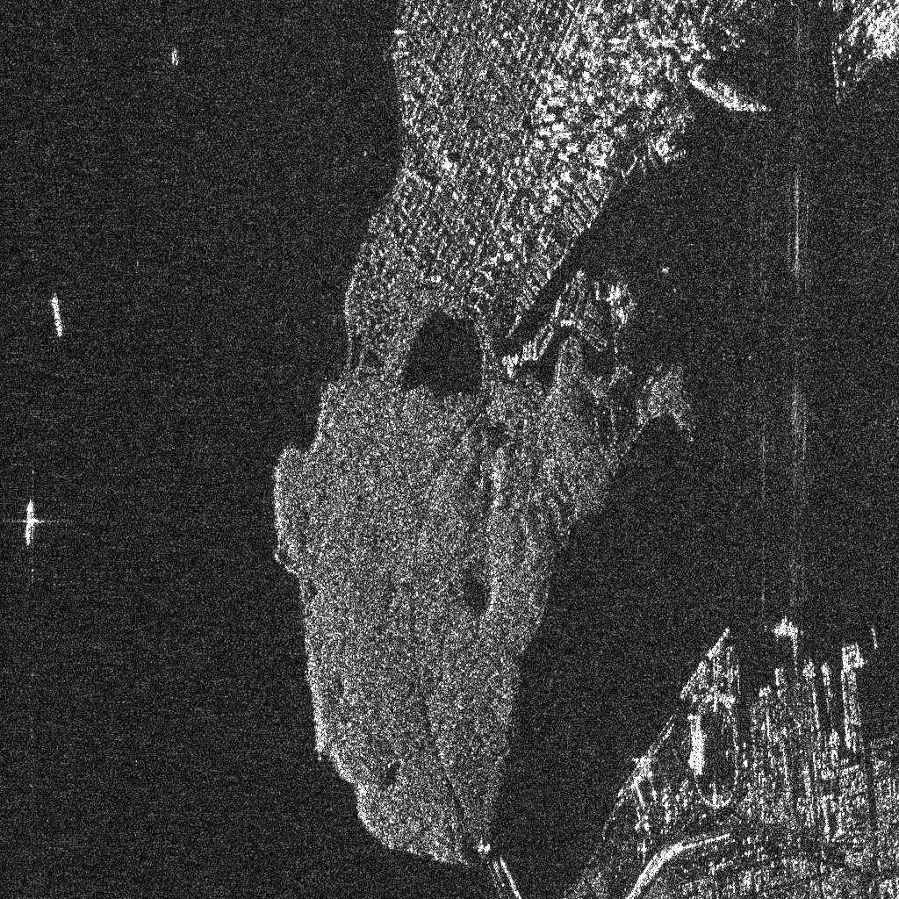
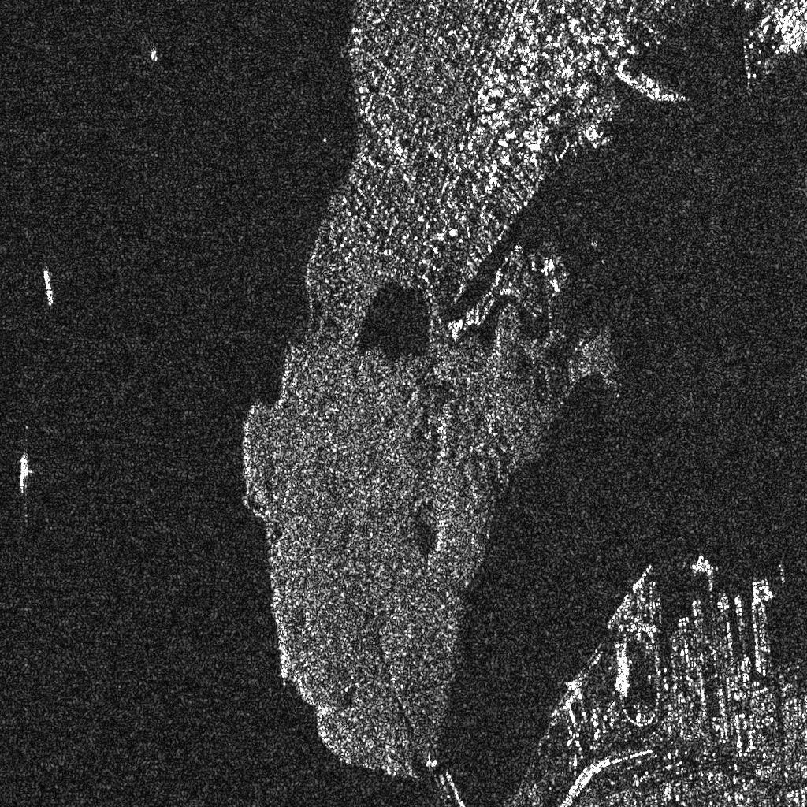
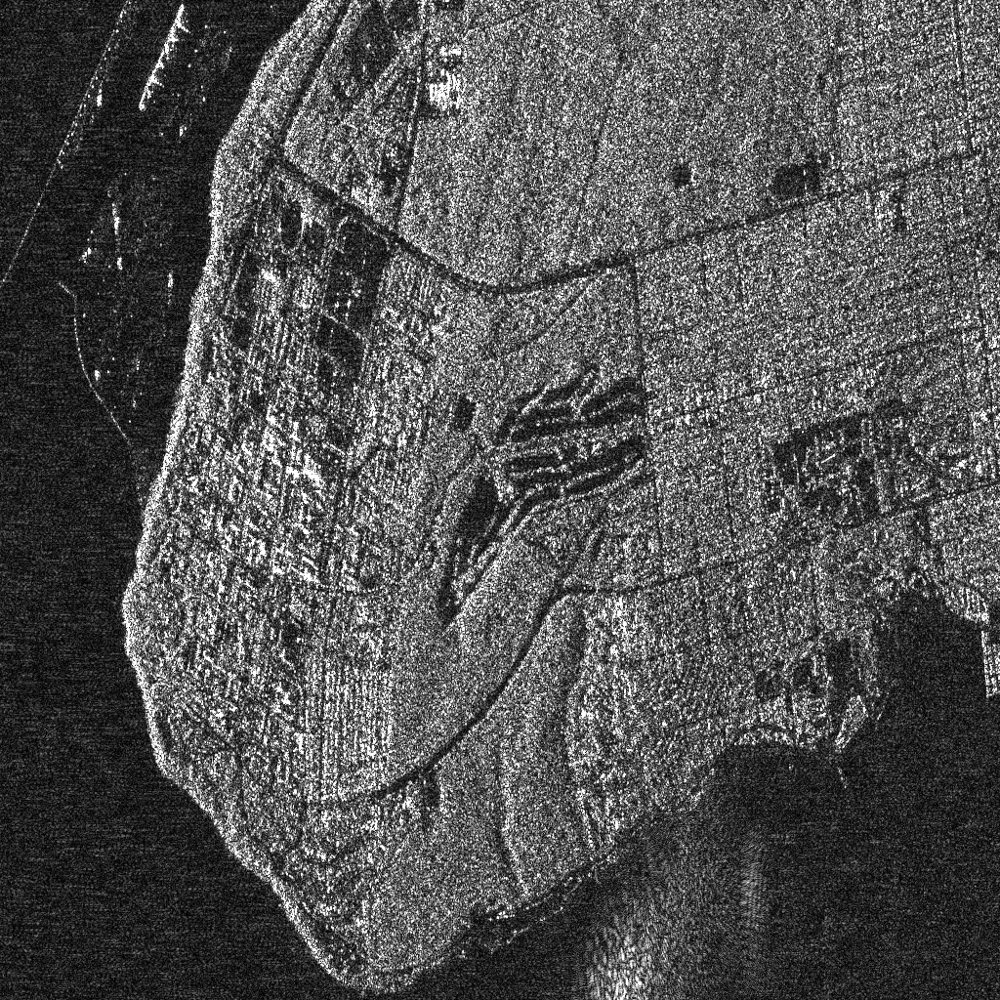
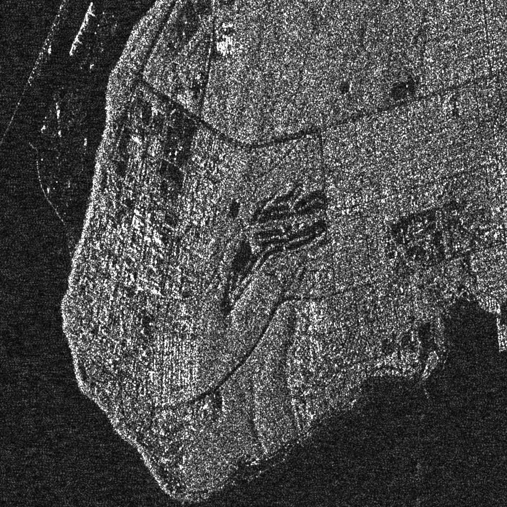
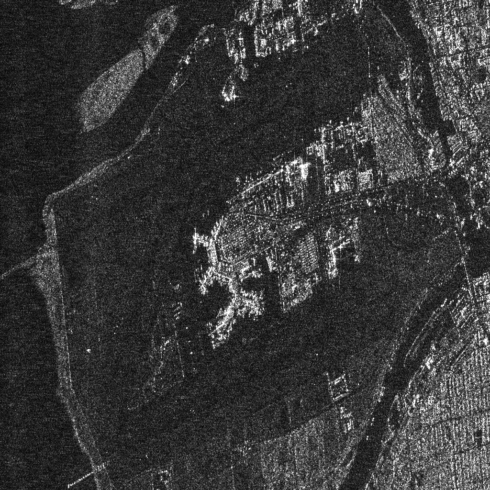
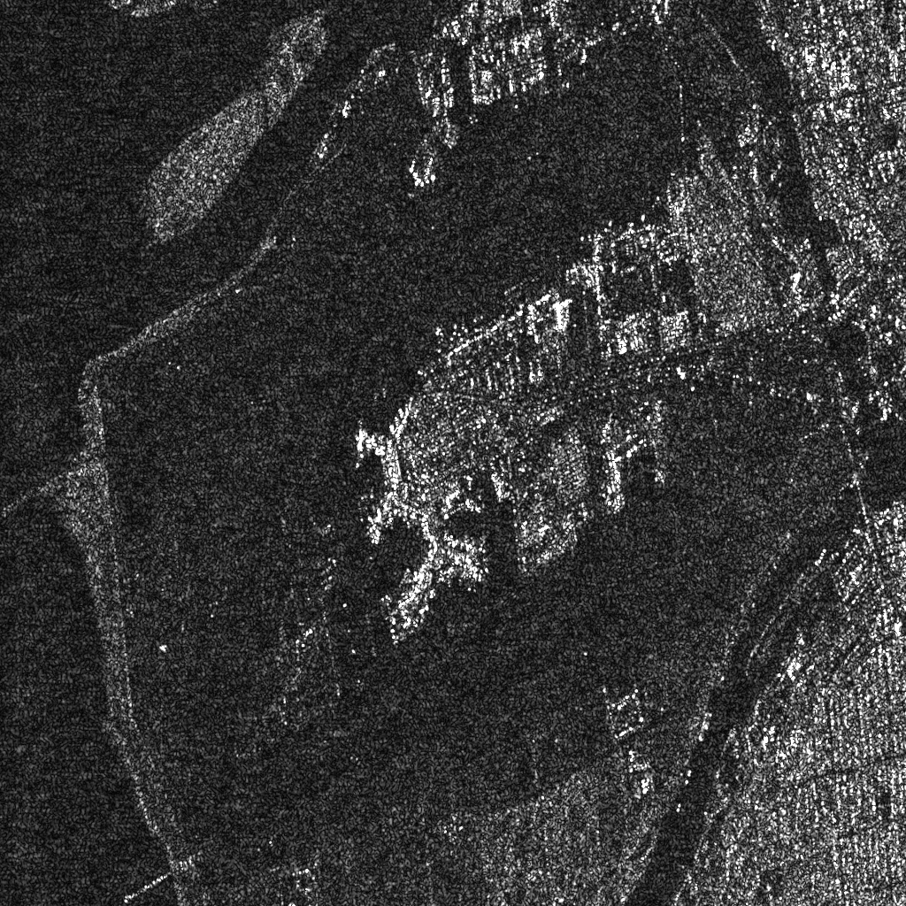

# Welcome to AISAR

Artificial Intelligence for Synthetic Aperture Radar.

## Projects

- [torchsar](https://aisari.iridescent.ink/torchsar): Synthetic Aperture Radar in PyTorch.
- [iprs3.0](https://iridescent.ink/iprs3.0/): Synthetic Aperture Radar in Python.

<figure>

</figure>
ALOS, Stanley Park,  ENVI (Left), Torchsar (Right)

<figure>

</figure>
ALOS, University of British Columbia,  ENVI (Left), Torchsar (Right)

<figure>

</figure>
ALOS, Vancouver Airport,  ENVI (Left), Torchsar (Right)

The focusing module of ENVI SARscape generates complex images (SLC) based on a ``ω-k`` frequency domain algorithm. The results of ENVI shown above have been processed by radiometric and geometric correction. [more](https://www.l3harrisgeospatial.com/Portals/0/pdfs/HG_SARscape_brochure_WEB.pdf)

The results of Torchsar shown above were focused by  Range Doppler Algorithm (RDA). The hamming window is utilized to  suppress the sidelobe.

## Links

|      |      |      |
| ---- | ---- | ---- |
| [homepage](https://iridescent.ink)     | [sar](https://sar.iridescent.ink)     | [ai](https://ai.iridescent.ink)     |
| [github ant](https://github.com/antsfamily)     | [github sar](https://github.com/aisari)     | [github ai](https://github.com/metai)     |
| [research](https://iridescent.ink/research/)   | [projects](https://iridescent.ink/projects/)       | [tutorials](https://iridescent.ink/tutorials/)       |
| [improc](https://iridescent.ink/improc/)    | [iprs3.0](https://iridescent.ink/iprs3.0/) | [pysparse](https://iridescent.ink/pysparse/) |
| [csdn](https://iridescent.blog.csdn.net/)   |  |   |

